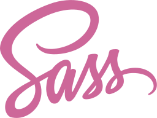

### Hi there 👋, my name is Maria
#### I am a self-taught React developer

- 🔭 I’m currently working as a React developer at a big software company

- 📚 One of my most recent projects is [Educator's assistant](https://www.ajutoruleducatorului.ro/) - an online platform that aims to empower preschool educators to teach kids better, to manage class easier and to quiz kids smarter. The product is launched, 5k+ users ✨

- 🌱 I’m currently learning Solidity, NextJS, Prisma 

- :eyes: I’m actively looking for a full-time job as a front-end engineer in a web3 company, here is my [resume](https://github.com/mariavarvaroi/mariavarvaroi/blob/71f6b8e1dfccf11358c8148de45cff03cebc6bb1/assets/Maria%20Varvaroi.pdf)

## Languages and Tools:

<code></code> 
<code></code> 
<code></code> 
<code></code> 
<code></code> 
<code></code> 
<code></code> 
<code></code> 
<code></code> 
<code></code> 

- 📫 How to reach me: 

   [Email](mailto:varvaroimaria@gmail.com)
   
   [LinkedIn](https://www.linkedin.com/in/maria-varvaroi/)
   
<!--
**mariavarvaroi/mariavarvaroi** is a ✨ _special_ ✨ repository because its `README.md` (this file) appears on your GitHub profile.

Here are some ideas to get you started:

- 🤔 I’m looking for help with ...
- 💬 Ask me about ...
- 😄 Pronouns: ...
- ⚡ Fun fact: ...
-->
